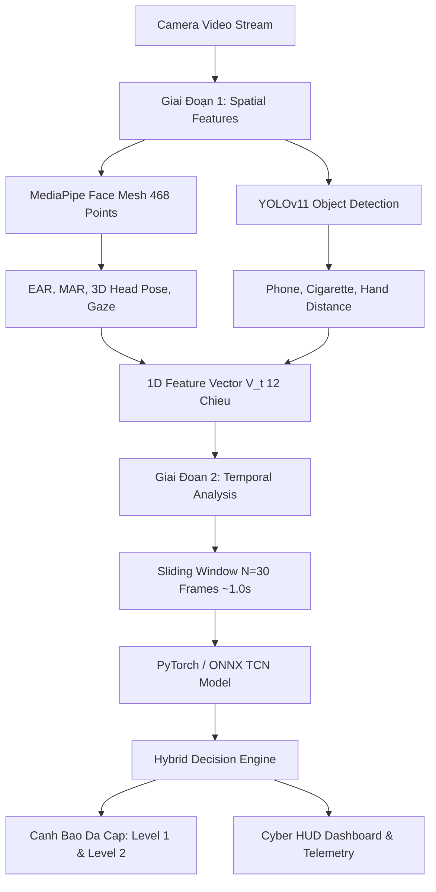

# 🚗 GuardCabin DMS - Hệ Thống Giám Sát & Cảnh Báo Trạng Thái Tài Xế

> **Hệ thống AI thị giác máy tính giám sát trạng thái tài xế theo thời gian thực (Real-time Driver Monitoring System - DMS)**  
> Ứng dụng **Kiến trúc hai giai đoạn (Two-Stage Pipeline)** kết hợp xử lý đặc trưng không gian (Spatial Features) và chuỗi thời gian (Temporal Features) để đạt độ chính xác cao và tối ưu hóa tốc độ xử lý ($\ge 30\text{ FPS}$).

---

## 🌟 Tính Năng Nổi Bật

- 👁️ **Giám sát sinh học thời gian thực**: Đo lường chính xác tỷ lệ mở mắt ($EAR$) và mở miệng ($MAR$) từ 468 điểm mốc 3D của MediaPipe Face Mesh; phát hiện nháy mắt chậm, ngủ gật và ngáp.
- 📐 **Ước lượng tư thế & hướng chú ý 3D**: Sử dụng thuật toán Perspective-n-Point (`cv2.solvePnP`) tính toán góc quay đầu ($Pitch, Yaw, Roll$) và hướng nhìn của mắt ($Gaze$), nhận diện ngay lập tức khi tài xế quay đầu nhìn hướng khác hoặc gật gù.
- 📱 **Nhận diện hành vi vi phạm bằng YOLOv11**: Tích hợp YOLOv11 (ONNX Runtime / PyTorch) phát hiện vật thể can thiệp như điện thoại di động, thuốc lá, bình nước ở vùng khoang lái.
- 🧠 **Phân tích chuỗi thời gian bằng mạng TCN (Temporal Convolutional Network)**: Mạng tích chập 1D theo thời gian với các lớp Causal Dilated Convolutions giúp mở rộng trường nhìn quá khứ, loại bỏ hoàn toàn độ trễ và đạt tốc độ xử lý siêu nhanh trên CPU/GPU.
- 🛡️ **Bộ suy luận lai Failsafe Rules**: Kết hợp phán quyết của TCN và cơ chế luật phản ứng tức thời (< 100ms) khi phát hiện mắt nhắm kéo dài $\ge 1.2\text{s}$, đảm bảo an toàn tuyệt đối.
- 🔊 **Cảnh báo âm thanh đa cấp độ trễ thấp**: Quản lý cảnh báo Level 1 (nhẹ nhàng, nhắc nhở) và Level 2 (còi hú khẩn cấp) chạy trên worker thread độc lập không làm giảm FPS video.
- 💻 **Giao diện Cyber HUD trực quan**: Hiển thị đồ thị sóng cuộn thời gian thực của $EAR$ và $MAR$, la bàn đầu 3D, thẻ đo sinh trắc học, điểm tập trung (Focus Score 0-100%) và thống kê phiên lái xe.

---

## 🧱 Kiến Trúc Hệ Thống (System Architecture)



---

## 📊 6 Lớp Trạng Thái Phân Loại (Classes)

| STT | Mã Lớp | Tên Trạng Thái | Dấu Hiệu Nhận Biết Kỹ Thuật | Hành Động Cảnh Báo |
| :---: | :---: | :--- | :--- | :--- |
| **0** | `Normal` | Lái xe bình thường / Tập trung | $EAR$ bình thường ($> 0.25$), đầu hướng thẳng, không có vật thể vi phạm | An toàn (Đèn Xanh) |
| **1** | `Drowsy` | Buồn ngủ / Mệt mỏi / Microsleep | $EAR < 0.20$ kéo dài liên tục $\ge 35\text{ frames}$ ($\approx 1.2\text{s}$) | **Còi hú khẩn cấp Level 2** |
| **2** | `Yawn` | Ngáp liên tục | $MAR > 0.52$ kéo dài chu kỳ $\ge 25\text{ frames}$ | Nhắc nhở nghỉ ngơi Level 1 |
| **3** | `Distracted` | Mất tập trung / Nhìn lệch hướng | Góc xoay đầu $\|Yaw\| > 25^\circ$ hoặc $\|Pitch\| > 20^\circ$ kéo dài $> 1.3\text{s}$ | **Âm thanh cảnh báo Level 1** |
| **4** | `Phone` | Sử dụng điện thoại di động | Bounding box Phone có độ tin cậy $> 0.4$ và khoảng cách sát mặt | **Báo động vi phạm Level 2** |
| **5** | `Smoking` | Hút thuốc / Uống nước | Phát hiện điếu thuốc / chai nước tại vùng miệng | Hiển thị cảnh báo vi phạm |

---

## 📁 Cấu Trúc Mã Nguồn

```
d:/Ki7/CV/duan/
├── config.py                   # Cấu hình ngưỡng cảnh báo, thông số camera, kích thước cửa sổ trượt
├── requirements.txt            # Danh sách thư viện phụ thuộc
├── weights/                    # Thư mục lưu trữ trọng số mô hình (.pth, .onnx)
│   ├── tcn_dms.pth
│   └── tcn_dms.onnx
├── features/                   # Giai đoạn 1: Trích xuất đặc trưng không gian
│   ├── face_mesh.py            # MediaPipe Face Mesh: EAR, MAR, Head Pose 3D (solvePnP), Gaze
│   └── feature_extractor.py    # Tổng hợp Spatial Feature Vector 1D (V_t 12 chiều)
├── models/                     # Mô hình AI & Inference Engine
│   ├── tcn.py                  # Kiến trúc PyTorch Temporal Convolutional Network
│   ├── tcn_classifier.py       # Inference TCN hỗ trợ cả ONNX Runtime & PyTorch
│   └── yolo_detector.py        # Detector YOLOv11 ONNX/PyTorch cho Phone, Cigarette
├── core/                       # Điều phối trung tâm
│   ├── sliding_window.py       # Bộ đệm cửa sổ trượt vòng (Ring Buffer) luồng an toàn
│   ├── decision_engine.py      # Bộ phán quyết lai (TCN + Failsafe Heuristic Rules)
│   ├── alert_manager.py        # Quản lý cảnh báo âm thanh đa cấp độ trễ thấp
│   └── session_tracker.py      # Thống kê phiên lái (chớp mắt/phút, số lần ngáp, an toàn)
├── ui/                         # Giao diện hiển thị
│   └── hud_overlay.py          # Cyber HUD: Biểu đồ sóng EAR/MAR, la bàn đầu 3D, thanh trạng thái
├── dataset/                    # Dữ liệu & Training
│   ├── generate_synthetic_data.py # Sinh dữ liệu chuỗi Vector sinh trắc học thực tế
│   └── data_loader.py          # PyTorch Sequence Dataset & DataLoader
├── train_tcn.py                # Script huấn luyện TCN, đánh giá F1 và tự động xuất sang ONNX
├── main.py                     # Ứng dụng chạy thời gian thực qua Webcam
├── run_video.py                # Chạy kiểm thử trên file Video và xuất video demo
├── test_system.py              # Bộ Unit Test & Integration Test kiểm tra toàn diện
├── RUN_GUIDE.md                # Hướng dẫn chi tiết cài đặt và vận hành hệ thống (Tiếng Việt)
└── README.md                   # Tài liệu tổng quan dự án
```

---

## ⚡ Hướng Dẫn Nhanh (Quickstart)

```bash
# 1. Cài đặt thư viện
pip install -r requirements.txt

# 2. Chạy bộ kiểm thử hệ thống
python test_system.py

# 3. Huấn luyện mô hình TCN và xuất ONNX
python train_tcn.py

# 4. Khởi động hệ thống giám sát qua Webcam
python main.py
```

> 📖 Xem hướng dẫn đầy đủ, chi tiết từng bước tại [RUN_GUIDE.md](file:///d:/Ki7/CV/duan/RUN_GUIDE.md).
