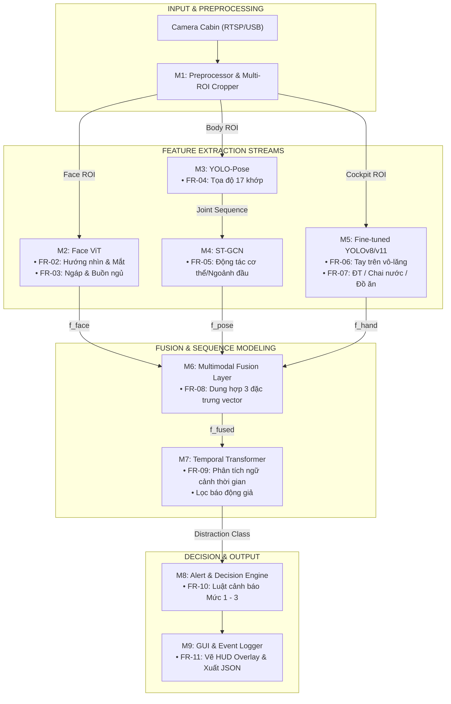

# TÀI LIỆU ĐẶC TẢ YÊU CẦU HỆ THỐNG (SRS)
## HỆ THỐNG GIÁM SÁT HÀNH VI TÀI XẾ ĐA MÔ THỨC (MULTIMODAL DRIVER MONITORING SYSTEM - DMS)

---

## 1. TỔNG QUAN HỆ THỐNG (SYSTEM OVERVIEW)

### 1.1. Giới thiệu & Mục tiêu
Hệ thống **Giám sát Tài xế Đa mô thức (Multimodal Driver Monitoring System - DMS)** là giải pháp thị giác máy tính thông minh hoạt động thời gian thực (real-time) bên trong cabin xe. Hệ thống tiếp nhận luồng video từ camera giám sát tài xế (`DRIVER VIDEO`) và phát hiện, đánh giá các trạng thái nguy hiểm như: mất tập trung, buồn ngủ, sử dụng điện thoại, hoặc buông tay khỏi vô-lăng.

Mục tiêu cốt lõi của kiến trúc là **kết hợp thông tin đa giác quan / đa mô thức (Multimodal)** với **phân tích chuỗi thời gian (Temporal Modeling)** nhằm khắc phục triệt để nhược điểm của các hệ thống đơn nhánh (như báo động giả khi tài xế chỉ liếc gương hậu, hoặc điểm mù do góc quay/che khuất).

### 1.2. Thuật ngữ & Từ viết tắt

| Thuật ngữ | Tên đầy đủ | Giải thích |
| :--- | :--- | :--- |
| **DMS** | Driver Monitoring System | Hệ thống giám sát trạng thái và hành vi tài xế |
| **ROI** | Region of Interest | Vùng ảnh quan tâm (Khuôn mặt, bàn tay, thân người) |
| **ViT** | Vision Transformer | Mô hình kiến trúc Transformer ứng dụng cho xử lý ảnh |
| **ST-GCN** | Spatial-Temporal Graph Convolutional Network | Mạng tích chập đồ thị không - thời gian phân tích khung xương |
| **Keypoints** | Tọa độ khớp xương | Các điểm đặc trưng cơ thể (mắt, mũi, vai, khuỷu tay, cổ tay) |
| **EAR / MAR**| Eye / Mouth Aspect Ratio | Tỷ lệ mở mắt / mở miệng dùng ước lượng buồn ngủ, ngáp |
| **PERCLOS** | Percentage of Eye Closure | Tỷ lệ phần trăm thời gian mắt nhắm trong khoảng thời gian nhất định |
| **BBox** | Bounding Box | Khung chữ nhật bao quanh vật thể được phát hiện |

---

## 2. MA TRẬN PHÂN CÔNG MODEL VÀ CHỨC NĂNG (MODEL-TO-FUNCTION MATRIX)

Bảng dưới đây phân định rõ ràng trách nhiệm của từng Model / Phân hệ phần mềm trong hệ thống:

| STT | Phân hệ / Model | Chức năng đảm nhiệm chính | Đầu vào (Input) | Đầu ra (Output) |
| :---: | :--- | :--- | :--- | :--- |
| **M1** | **Bộ tiền xử lý & Cắt vùng (Preprocessor & ROI Cropper)** | • Giải mã luồng RTSP/Camera.<br/>• Phát hiện và cắt 3 vùng ROI độc lập (`Face ROI`, `Upper Body`, `Cockpit Area`). | Frame gốc (1920x1080 / 1280x720) | 3 ảnh con (ROI tensors) chuẩn hóa kích thước |
| **M2** | **Face ViT (Vision Transformer)** | • Ước lượng hướng nhìn (Gaze Direction).<br/>• Nhận diện trạng thái mắt (đóng/mở, PERCLOS).<br/>• Phát hiện cử động ngáp (Yawning) và góc nghiêng đầu (Head Pose). | `Face ROI` (224x224x3) | Vector đặc trưng khuôn mặt $\mathbf{f}_{\text{face}} \in \mathbb{R}^{d_1}$ + Các chỉ số gaze/EAR/MAR |
| **M3** | **YOLO-Pose (v8/v11-Pose)** | • Trích xuất tọa độ 2D của 17 điểm khớp xương thân trên theo thời gian thực.<br/>• Theo dõi chuyển động tay, vai, đầu. | `Upper Body ROI` (256x256x3) | Ma trận tọa độ khớp $\mathbf{K} \in \mathbb{R}^{V \times 3}$ ($x, y, \text{conf}$) |
| **M4** | **ST-GCN (Spatial-Temporal GCN)** | • Học quan hệ không gian giữa các khớp.<br/>• Phân tích chuỗi biến đổi khung xương qua thời gian để nhận diện hành vi động: cúi người, rướn tay lấy đồ, ngoảnh mặt ra sau. | Chuỗi $T$ khung hình khớp $\mathbf{K}_{1:T} \in \mathbb{R}^{T \times V \times C}$ | Vector đặc trưng tư thế $\mathbf{f}_{\text{pose}} \in \mathbb{R}^{d_2}$ |
| **M5** | **YOLOv8 / YOLOv11 (Fine-tuned)** | • Định vị bàn tay và vùng vô-lăng.<br/>• Phát hiện vật thể gây xao nhãng: điện thoại, chai nước, đồ ăn, thuốc lá. | `Cockpit ROI` (640x640x3) | Danh sách BBox, nhãn vật thể + Vector đặc trưng $\mathbf{f}_{\text{hand}} \in \mathbb{R}^{d_3}$ |
| **M6** | **Multimodal Fusion Layer** | • Chuẩn hóa và dung hợp thông tin 3 luồng (Face + Pose + Hands).<br/>• Chiếu về không gian biểu diễn chung (Shared Latent Space). | 3 vector $[\mathbf{f}_{\text{face}}, \mathbf{f}_{\text{pose}}, \mathbf{f}_{\text{hand}}]$ | Vector dung hợp tổng hợp $\mathbf{f}_{\text{fused}} \in \mathbb{R}^{D}$ |
| **M7** | **Temporal Transformer** | • Mô hình hóa tiến trình thời gian qua cửa sổ trượt $T$ frame.<br/>• Phân biệt hành vi bình thường tạm thời với hành vi vi phạm kéo dài.<br/>• Dự đoán xác suất lớp phân tâm cuối cùng. | Chuỗi $T$ vector dung hợp $(\mathbf{f}_{\text{fused}, 1}, \dots, \mathbf{f}_{\text{fused}, T})$ | Phân phối xác suất lớp hành vi $\mathbf{y} \in \mathbb{R}^{C}$ (`Distraction Class`) |
| **M8** | **Bộ luật cảnh báo (Alert & Decision Engine)** | • Kiểm tra ngưỡng xác suất và ngưỡng thời gian vi phạm.<br/>• Kích hoạt chuông còi, cảnh báo màn hình và ghi log dữ liệu. | Nhãn lớp + Thời gian vi phạm liên tục $\Delta t$ | Tín hiệu còi báo (Buzzer), Giao diện UI, JSON Log |
| **M9** | **Giao diện & Ghi nhật ký (GUI & Event Logger)** | • Vẽ BBox, khung xương, hướng nhìn lên màn hình giám sát.<br/>• Lưu video bằng chứng sự kiện và metadata JSON. | Frame gốc + Tọa độ BBox/Keypoints + Log status | Màn hình hiển thị + Database log sự kiện |

---

## 3. ĐẶC TẢ CHI TIẾT CÁC YÊU CẦU CHỨC NĂNG (FUNCTIONAL REQUIREMENTS - FR)

### FR-01: Thu nhận Video & Tiền xử lý Đa vùng (Video Acquisition & Multi-ROI Cropping)
* **Model / Phân hệ đảm nhiệm:** `M1: Preprocessor & ROI Cropper`
* **Mô tả chức năng:**
  1. Tiếp nhận luồng video liên tục từ camera cabin với chuẩn 30 FPS.
  2. Áp dụng thuật toán phát hiện người nhanh để định vị và cắt 3 vùng ảnh riêng biệt cho từng khung hình:
     * `Face ROI`: Vùng chứa khuôn mặt tài xế (mở rộng biên 15% để tránh mất cằm/trán khi cử động).
     * `Body ROI`: Vùng thân trên từ đỉnh đầu tới thắt lưng.
     * `Cockpit ROI`: Vùng vô-lăng, taplo và hai bên cánh tay tài xế.
  3. Chuẩn hóa kích thước ảnh (Resize), đổi hệ màu RGB và chuẩn hóa giá trị pixel về dải $[0, 1]$.

---

### FR-02: Ước lượng Hướng nhìn & Trạng thái Mắt (Gaze Direction & Eye State Tracking)
* **Model đảm nhiệm:** `M2: Face ViT (Vision Transformer)`
* **Mô tả chức năng:**
  1. **Theo dõi hướng nhìn (Gaze Tracking):** Dự đoán vector hướng nhìn 3D của đồng tử mắt và phân loại vùng nhìn:
     * Nhìn đường phía trước (`Forward Road`).
     * Nhìn gương chiếu hậu trái/phải (`Left/Right Mirror`).
     * Nhìn gương trần (`Rearview Mirror`).
     * Nhìn xuống bảng điều khiển / lòng / điện thoại (`Looking Down`).
  2. **Ước lượng trạng thái mắt (Eye Closure & PERCLOS):**
     * Xác định mắt đóng hay mở trong từng frame.
     * Tính toán chỉ số PERCLOS (tỷ lệ phần trăm thời gian nhắm mắt trong cửa sổ 60 giây).
  3. **Độ trễ xử lý tối đa:** $\le 20\text{ms/frame}$.

---

### FR-03: Nhận diện Biểu cảm Mệt mỏi & Ngáp ngủ (Fatigue & Yawning Detection)
* **Model đảm nhiệm:** `M2: Face ViT kết hợp thuật toán tính MAR`
* **Mô tả chức năng:**
  1. Nhận diện trạng thái mở rộng của khuôn miệng liên quan đến hành vi ngáp (Yawning).
  2. Tính tỷ lệ mở miệng $MAR = \frac{\|p_2 - p_8\| + \|p_3 - p_7\|}{2 \cdot \|p_1 - p_5\|}$.
  3. Gắn cờ cảnh báo dấu hiệu mệt mỏi khi tài xế ngáp liên tục hoặc có chuỗi ngáp kéo dài trên $3.0$ giây.

---

### FR-04: Trích xuất Tọa độ Khung xương Khớp 2D (Keypoints Extraction)
* **Model đảm nhiệm:** `M3: YOLO-Pose`
* **Mô tả chức năng:**
  1. Trích xuất chính xác 17 điểm khớp xương chính trên cơ thể tài xế:
     * Điểm mặt: Mũi, mắt trái/phải, tai trái/phải.
     * Thân trên: Cổ, vai trái/phải, khuỷu tay trái/phải, cổ tay trái/phải.
     * Hông: Hông trái/phải.
  2. Trả về tọa độ $(x_i, y_i)$ kèm điểm số tin cậy $c_i \in [0, 1]$ cho mỗi khớp.
  3. Duy trì khả năng trích xuất ổn định ngay cả khi một phần cánh tay bị che khuất bởi vô-lăng.

---

### FR-05: Phân tích Động lực học Chuyển động Cơ thể (Skeletal Action Recognition)
* **Model đảm nhiệm:** `M4: ST-GCN (Spatial-Temporal Graph Convolutional Network)`
* **Mô tả chức năng:**
  1. Tiếp nhận chuỗi khung xương $T$ frame liên tiếp từ `M3`.
  2. Xây dựng đồ thị $G = (V, E)$ với $V$ là các khớp xương và $E$ là các liên kết vật lý cơ thể qua các bước thời gian.
  3. Phân loại các hành vi cơ thể bất thường:
     * `Reaching Behind`: Xoay người, vươn tay ra ghế sau tìm đồ.
     * `Bending Down`: Cúi gập người xuống sàn xe nhặt đồ rơi.
     * `Leaning Sideways`: Rướn người nói chuyện với người ngồi ghế phụ hoặc thò tay sang hộc đồ.

---

### FR-06: Ước lượng Vị trí Bàn tay & Trạng thái Tương tác (Hand Position Estimation)
* **Model đảm nhiệm:** `M5: Fine-tuned YOLOv8 / YOLOv11`
* **Mô tả chức năng:**
  1. Ước lượng vị trí của hai bàn tay tài xế trong khoang lái (`Cockpit Area`).
  2. Kết hợp với tọa độ cổ tay từ nhánh khung xương (`YOLO-Pose`) để xác định trạng thái tương tác:
     * Bàn tay ở vị trí bình thường (`Normal / Hands Visible`).
     * Bàn tay giơ cao gần vùng đầu / tai (`Hand Raised to Face`).
     * Bàn tay đang cầm nắm vật thể (`Holding Object`).
  3. Cung cấp thông tin bổ trợ cho nhánh phát hiện điện thoại và ăn uống.

---

### FR-07: Phát hiện Vật thể Gây xao nhãng (Distracting Object Detection)
* **Model đảm nhiệm:** `M5: Fine-tuned YOLOv8 / YOLOv11`
* **Mô tả chức năng:**
  1. Phát hiện và phân loại các vật thể nguy hiểm trong cabin:
     * `Cellphone`: Điện thoại đang cầm trên tay, áp tai, hoặc đặt ở đùi.
     * `Bottle / Cup`: Chai nước hoặc cốc nước đang uống.
     * `Food`: Thức ăn nhanh, bánh mì, đồ ăn vặt.
     * `Cigarette`: Điếu thuốc lá trên tay hoặc ngậm ở miệng.
  2. Trả về Bounding Box, nhãn lớp và độ tin cậy ($conf \ge 0.65$).

---

### FR-08: Dung hợp Đặc trưng Đa mô thức (Multimodal Feature Fusion)
* **Model / Lớp đảm nhiệm:** `M6: Multimodal Fusion Layer`
* **Mô tả chức năng:**
  1. Tiếp nhận 3 vector đặc trưng từ 3 nhánh:
     * $\mathbf{f}_{\text{face}} \in \mathbb{R}^{256}$ từ Face ViT.
     * $\mathbf{f}_{\text{pose}} \in \mathbb{R}^{256}$ từ ST-GCN.
     * $\mathbf{f}_{\text{hand}} \in \mathbb{R}^{256}$ từ YOLO.
  2. Thực hiện phép chiếu tuyến tính (Linear Projection) và ghép nối (Concat) kết hợp cơ chế Cross-Attention để tạo ra vector đặc trưng dung hợp:
     $$\mathbf{f}_{\text{fused}} = \text{LayerNorm}(\mathbf{W}_f [\mathbf{f}_{\text{face}} \,\|\, \mathbf{f}_{\text{pose}} \,\|\, \mathbf{f}_{\text{hand}}] + \mathbf{b}_f)$$
  3. Triệt tiêu các điểm mù cục bộ khi một trong các nhánh bị che khuất hoặc nhiễu sáng.

---

### FR-09: Mô hình hóa Ngữ cảnh Thời gian & Lọc Báo động Giả (Temporal Sequence Modeling)
* **Model đảm nhiệm:** `M7: Temporal Transformer`
* **Mô tả chức năng:**
  1. Duy trì bộ đệm trượt (Sliding Window) lưu $T$ vector dung hợp liên tiếp gần nhất ($T = 30 - 60$ frames, tương đương $1 - 2$ giây video).
  2. Áp dụng các khối Temporal Multi-Head Attention để học quan hệ phụ thuộc thời gian giữa các khung hình.
  3. Phân biệt rõ ràng giữa thao tác hợp lệ ngắn hạn và hành vi vi phạm kéo dài:
     * Liếc nhìn gương hậu $\le 1.0\text{s} \rightarrow$ Hợp lệ.
     * Nhìn lệch khỏi đường $\ge 2.0\text{s} \rightarrow$ Phân tâm.
  4. Xuất ra phân phối xác suất của 6 lớp hành vi phân tâm cuối cùng.

---

### FR-10: Bộ Luật Kích hoạt Cảnh báo Đa cấp độ (Multi-Level Alert Engine)
* **Model / Module đảm nhiệm:** `M8: Alert & Decision Engine`
* **Mô tả chức năng:**
  1. Tiếp nhận nhãn lớp từ `M7` và theo dõi biến đếm thời gian vi phạm liên tục $\Delta t$.
  2. Áp dụng bảng quy tắc ngưỡng để kích hoạt cấp độ cảnh báo tương ứng:
     * **Mức 0 (An toàn):** Lái xe bình thường, không cảnh báo.
     * **Mức 1 (Nhắc nhở nhẹ):** Hiển thị icon cảnh báo màu vàng trên màn hình GUI khi phát hiện ăn uống hoặc buông 1 tay quá lâu.
     * **Mức 2 (Nguy hiểm):** Bật tiếng bíp nhắc nhở + viền đỏ màn hình khi cầm điện thoại hoặc buông cả 2 tay $> 2.5\text{s}$.
     * **Mức 3 (Nguy cấp):** Còi hú liên tục + rung ghế/vô-lăng khi tài xế ngủ gật (nhắm mắt liên tục $> 2.0\text{s}$).

---

### FR-11: Trực quan hóa Giao diện & Ghi Log Sự kiện (GUI Overlay & Event Logging)
* **Module đảm nhiệm:** `M9: GUI & Event Logger`
* **Mô tả chức năng:**
  1. Vẽ lớp phủ thông tin (HUD Overlay) lên màn hình giám sát thời gian thực:
     * Khung BBox bàn tay và vật thể.
     * Đường nối khung xương 17 khớp của tài xế.
     * Mũi tên 3D biểu diễn hướng nhìn (Gaze arrow).
     * Đồng hồ đo mức độ phân tâm (Distraction Gauge) từ $0\%$ đến $100\%$.
  2. Tự động trích xuất và lưu đoạn video clip $10$ giây (5 giây trước + 5 giây sau vi phạm) khi xảy ra cảnh báo Mức 2 và Mức 3.
  3. Xuất log sự kiện dưới định dạng chuẩn JSON để đồng bộ về hệ thống quản lý đội xe (Fleet Management Server).

---

## 4. SƠ ĐỒ ÁNH XẠ KIẾN TRÚC MÔ HÌNH VÀ CHỨC NĂNG



---

## 5. ĐẶC TẢ KỸ THUẬT & KIẾN TRÚC TỪNG MODEL

### 5.1. Model M2: Face ViT (Vision Transformer)
* **Kiến trúc:** ViT-Tiny hoặc MobileViT được tối ưu hóa cho Edge AI.
* **Kích thước đầu vào:** $224 \times 224 \times 3$, chuẩn hóa ImageNet (`mean=[0.485, 0.456, 0.406]`, `std=[0.229, 0.224, 0.225]`).
* **Patch Size:** $16 \times 16$ (tổng cộng 196 patches).
* **Đầu ra:**
  * Embedding vector $\mathbf{f}_{\text{face}} \in \mathbb{R}^{256}$.
  * Head phân loại Gaze: 4 vùng nhìn (`Forward`, `Left`, `Right`, `Down`).
  * Head hồi quy EAR / Eye State: Nhắm/Mở ($0.0 - 1.0$).

### 5.2. Model M3: YOLO-Pose
* **Kiến trúc:** YOLOv8n-pose hoặc YOLOv11n-pose (phiên bản nano nhẹ nhất để đảm bảo FPS cao).
* **Kích thước đầu vào:** $256 \times 256 \times 3$.
* **Đầu ra:** Tensor khớp $17 \times 3$ gồm $(x_i, y_i, \text{confidence})$.

### 5.3. Model M4: ST-GCN (Spatial-Temporal Graph Convolutional Network)
* **Kiến trúc:** 9 khối ST-GCN layers (3 khối residual blocks: 64, 128, 256 channels).
* **Kích thước đầu vào:** Ma trận chuỗi $(N, C, T, V, M) = (1, 3, 30, 17, 1)$ với $T=30$ frames ($1.0$ giây video).
* **Đầu ra:** Feature vector $\mathbf{f}_{\text{pose}} \in \mathbb{R}^{256}$.

### 5.4. Model M5: Fine-tuned YOLO (YOLOv8 / YOLOv11)
* **Kiến trúc:** YOLOv8s hoặc YOLOv11s Object Detector.
* **Danh sách Class huấn luyện (Custom Classes):**
  1. `hand` (Bàn tay tài xế)
  2. `steering_wheel` (Vành vô-lăng)
  3. `cellphone` (Điện thoại thông minh)
  4. `drink_bottle` (Chai / Cốc nước)
  5. `cigarette` (Điếu thuốc)
  6. `food` (Thức ăn)
* **Kích thước đầu vào:** $640 \times 640 \times 3$.
* **Đầu ra:** Bounding boxes $[x_1, y_1, x_2, y_2, conf, cls\_id]$ + Trích xuất feature map ở neck tầng cuối làm $\mathbf{f}_{\text{hand}} \in \mathbb{R}^{256}$.

### 5.5. Model M6 & M7: Multimodal Fusion & Temporal Transformer
* **Fusion:**
  * Concatenate 3 vector $[256, 256, 256] \rightarrow 768$ dimensions.
  * Linear Projection Layer giảm chiều xuống $D = 256$.
* **Temporal Transformer:**
  * Số lớp Transformer Encoder: 2 layers.
  * Số Attention Heads: 4 heads.
  * Chiều dài chuỗi trượt: $T = 30$ hoặc $60$ steps.
  * Đầu ra cuối cùng: Lớp Linear Classifier $\rightarrow$ Softmax qua 6 lớp hành vi phân tâm.

---

## 6. DANH MỤC LỚP PHÂN LOẠI & LOGIC CẢNH BÁO
 
| Mã lớp | Tên lớp phân tâm | Model phát hiện chính | Điều kiện kích hoạt thời gian | Cấp độ cảnh báo | Hành động hệ thống |
| :---: | :--- | :--- | :--- | :---: | :--- |
| **C0** | **Safe Driving** | Toàn bộ pipeline | Trạng thái bình thường liên tục | **Mức 0** | Không báo động, hiển thị icon xanh an toàn. |
| **C1** | **Phone Usage** | M5 (YOLO) + M2 (Gaze) | Xuất hiện điện thoại & tay cầm kéo dài $> 1.5\text{s}$ | **Mức 2** | Phát tiếng chuông nhắc nhở, nhấp nháy viền cam. |
| **C2** | **Drowsiness / Yawning** | M2 (Face ViT) + M7 (Temporal) | Nhắm mắt PERCLOS $> 80\%$ trong $1.5\text{s}$ hoặc ngáp liên tục | **Mức 3** | Còi báo động to liên tục, rung cảnh báo, bật màn hình đỏ. |
| **C3** | **Reaching / Turning Body**| M4 (ST-GCN) + M7 (Temporal) | Thân người xoay ngoái sau hoặc cúi gập xuống sàn $> 1.5\text{s}$ | **Mức 1** | Âm báo nhẹ, hiển thị tin nhắn cảnh báo trên màn hình. |
| **C4** | **Eating / Drinking** | M5 (YOLO) + M2 (Face ViT) | Cầm đồ ăn / chai nước đưa lên miệng $> 3.0\text{s}$ | **Mức 1** | Hiển thị icon cảnh báo màu vàng, ghi log sự kiện. |

---

## 7. YÊU CẦU PHI CHỨC NĂNG (NON-FUNCTIONAL REQUIREMENTS)

* **NFR-01: Hiệu năng thời gian thực (FPS):** Toàn bộ pipeline đa luồng phải đạt tối thiểu **$\ge 25\text{ FPS}$** khi chạy trên GPU Laptop/Desktop (RTX 3060 trở lên) hoặc **$\ge 20\text{ FPS}$** trên phần cứng Edge AI (NVIDIA Jetson Orin Nano).
* **NFR-02: Độ trễ phản hồi (Latency):** Tổng thời gian từ khi frame vào camera đến khi có tín hiệu cảnh báo không vượt quá **$150\text{ms}$**.
* **NFR-03: Tỷ lệ báo động giả (False Positive Rate):** $\le 3\%$ đối với các tác vụ lái xe hợp lệ (nhìn gương chiếu hậu, ngoái đầu kiểm tra điểm mù trước khi chuyển làn).
* **NFR-04: Khả năng chống chịu ánh sáng (Lighting Invariance):** Hoạt động tốt trong điều kiện ban ngày, ngược sáng, và ban đêm hoàn toàn nhờ tương thích với luồng Camera hồng ngoại (IR camera).

---

## 8. ĐẶC TẢ GIAO DIỆN & DỮ LIỆU ĐẦU RA (SYSTEM INTERFACE & OUTPUT SPECIFICATION)

### 8.1. Định dạng gói tin JSON thời gian thực (Metadata Event Output)
```json
{
  "timestamp": "2026-09-23T11:03:45.120+07:00",
  "frame_id": 18450,
  "inference_fps": 28.4,
  "system_state": {
    "predicted_class": "Phone Usage",
    "class_id": "C1",
    "confidence": 0.938,
    "alert_level": 2,
    "violation_duration_sec": 2.15
  },
  "model_assignments": {
    "M2_face_vit": {
      "gaze": "looking_down",
      "eye_closed": false,
      "perclos": 0.05,
      "yawning": false
    },
    "M3_M4_pose_stgcn": {
      "posture": "right_arm_raised_to_ear",
      "head_pose": {"pitch": -12.4, "yaw": 8.1, "roll": 1.2}
    },
    "M5_yolo_objects": {
      "hands_on_wheel_status": "left_hand_only",
      "detected_items": [
        {
          "name": "cellphone",
          "confidence": 0.92,
          "bbox": [410, 220, 480, 330]
        }
      ]
    }
  },
  "action_commands": {
    "buzzer_active": true,
    "ui_banner_text": "CẢNH BÁO: PHÁT HIỆN TÀI XẾ SỬ DỤNG ĐIỆN THOẠI!",
    "save_video_evidence": true
  }
}
```

### 8.2. Giao diện Giám sát HUD (Head-Up Display Overlay)
1. **Lớp hiển thị trực tiếp (Live Stream HUD):**
   * Vẽ Bounding box viền màu quanh điện thoại, chai nước, bàn tay.
   * Vẽ bộ khung xương 17 điểm với đường nối xanh lá khi bình thường và đỏ khi tư thế nguy hiểm.
   * Vẽ mũi tên hướng nhìn (Gaze Arrow) từ tâm mắt hướng ra không gian phía trước.
2. **Bảng điều khiển trạng thái (Status Dashboard):**
   * Đồng hồ đo chỉ số phân tâm (`Distraction Meter` $0 - 100\%$).
   * Tần số khung hình thực tế (`Inference FPS`).
   * Nhật ký các lần cảnh báo theo dòng thời gian (Event History Log).